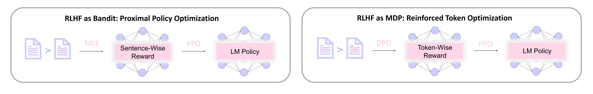

# Reinforced Token Optimization (RTO)
This repository contains the source code for our paper [DPO Meets PPO: Reinforced Token Optimization for RLHF](https://arxiv.org/abs/2404.18922). 

TL;DR: Based on theoretical insights, we propose Reinforced Token Optimization (RTO), a more sample efficient and effective RLHF algorithm than Proximal Policy Optimization (PPO). RTO outperforms PPO, Direct Preference Optimization (DPO) and other baselines on AlpacaEval 2 and Arena-Hard benchmarks by a large margin. 



## Model Releases and Evaluation Results
We release all model checkpoints in this [Huggingface Repo](https://huggingface.co/RTO-RL), which includes
- **SFT** [[OpenRLHF/Llama-3-8b-sft-mixture](https://huggingface.co/OpenRLHF/Llama-3-8b-sft-mixture)]: An open-source SFT model that finetunes [Llama-3-8B](https://huggingface.co/meta-llama/Meta-Llama-3-8B) with a diverse mixture of high-quality data.
- **DPO** [[Llama3-8B-DPO](https://huggingface.co/RTO-RL/Llama3-8B-DPO)]: Apply Direct Preference Optimization algorithm on the **SFT** model.
- **R-DPO** [[Llama3-8B-RDPO](https://huggingface.co/RTO-RL/Llama3-8B-RDPO)]: Apply R-Direct Preference Optimization algorithm on the **SFT** model.
- **SimPO** [[Llama3-8B-SimPO](https://huggingface.co/RTO-RL/Llama3-8B-SimPO)]: Apply Simple Preference Optimization algorithm on the **SFT** model.
- **TDPO** [[Llama3-8B-TDPO](https://huggingface.co/RTO-RL/Llama3-8B-TDPO)]: Apply Token-level Direct Preference Optimization algorithm on the **SFT** model.
- **PPO** [[Llama3-8B-PPO](https://huggingface.co/RTO-RL/Llama3-8B-PPO)]: Apply Proximal Policy Optimization algorithm on the **SFT** model, optimizing [this reward model](https://huggingface.co/RTO-RL/Llama3-8B-RewardModel).
- **RTO** [[Llama3-8B-RTO](https://huggingface.co/RTO-RL/Llama3-8B-RTO)]: Apply Reinforced Token Optimization algorithm on the **SFT** model, optimizing [this DPO reward model](https://huggingface.co/RTO-RL/Llama3-8B-DPO) and [this reward model](RTO-RL/Llama3.2-1B-RewardModel).

We use the UltraFeedback dataset. All preference learning uses [a binarized version](https://huggingface.co/datasets/HuggingFaceH4/ultrafeedback_binarized), while all reinforcement learning uses [a prompt-only version](https://huggingface.co/datasets/weqweasdas/ultra_train).


We evaluate  these models using the popular benchmarks [AlpacaEval 2](https://github.com/tatsu-lab/alpaca_eval) and [Arena-Hard](https://github.com/lm-sys/arena-hard-auto), and report the AlpacaEval 2 (raw win rate version and length-controlled version) and Arena-Hard scores (raw win rate version and style-controlled version) in the following table.

| models | AE2 LC | AE2 WR | AH SC | AH WR |
|:---:|--|--|--|--|
| [SFT](https://huggingface.co/OpenRLHF/Llama-3-8b-sft-mixture) | 13.22 | 8.58 | 9.2 | 8.9 |
| [DPO](https://huggingface.co/RTO-RL/Llama3-8B-DPO) | 17.40 | 12.23 | 13.2 | 13.8 |
| [R-DPO](https://huggingface.co/RTO-RL/Llama3-8B-RDPO) | 18.34 | 12.03 | 14.2 | 14.1 |
| [SimPO](https://huggingface.co/RTO-RL/Llama3-8B-SimPO) | 25.46 | 20.20 | 14.5 | 15.2 |
| [TDPO](https://huggingface.co/RTO-RL/Llama3-8B-TDPO) | 20.13 | 11.97 | 13.2 | 12.3 |
| [PPO](https://huggingface.co/RTO-RL/Llama3-8B-PPO) | 19.47 | 12.89 | 16.2 | 15.6 |
| [RTO](https://huggingface.co/RTO-RL/Llama3-8B-RTO) | **27.00** | **22.45** | **20.3** | **21.4** |


## News
- **[2025.2.12]** We updated our paper on [arxiv](https://arxiv.org/abs/2404.18922).
- **[2025.2.7]** We released our code and models.
- **[2024.4.29]** We released our paper on [arxiv](https://arxiv.org/abs/2404.18922).


## Install Requirements


```bash
conda create -n rto python=3.10
conda activate rto
conda install cuda -c nvidia/label/cuda-12.1.0
pip3 install torch==2.4.1 torchvision torchaudio
cd RTO
pip3 install -e .
```

## Training Scripts
We include the training scripts in `examples/scripts`.
```bash
bash examples/scripts/train_rto_llama_8b.sh
```
This is set for 8xA100 GPUs. You may adjust `micro_rollout_batch_size` and `micro_train_batch_size` based on your computation environment.


## Hyperparameter Tuning
Reinforcement learning algorithms may be sensitive to hyperparameter tuning. Based on OpenRLHF's well-tuned hyperparameters for PPO, the only additional parameter to tune is $\beta_1$ (`dpo_reward_scale` in code), the scale of DPO token rewards. Since the main contribution of DPO rewards is reward shaping rather than absolute gains, $\beta_1$ can be safely set to a small value. We recommand using $0.05$ as starting point, but the guideline is not to let DPO token rewards dominate.


## Acknowledgement
We would like to thank [OpenRLHF](https://github.com/OpenRLHF/OpenRLHF) for their excellent implementation of RLHF algorithms.

## Citation
If you find the content of this repo useful, please consider cite it as follows:

```bibtex
@article{zhong2024dpo,
  title={Dpo meets ppo: Reinforced token optimization for rlhf},
  author={Zhong, Han and Feng, Guhao and Xiong, Wei and Cheng, Xinle and Zhao, Li and He, Di and Bian, Jiang and Wang, Liwei},
  journal={arXiv preprint arXiv:2404.18922},
  year={2024}
}
```
